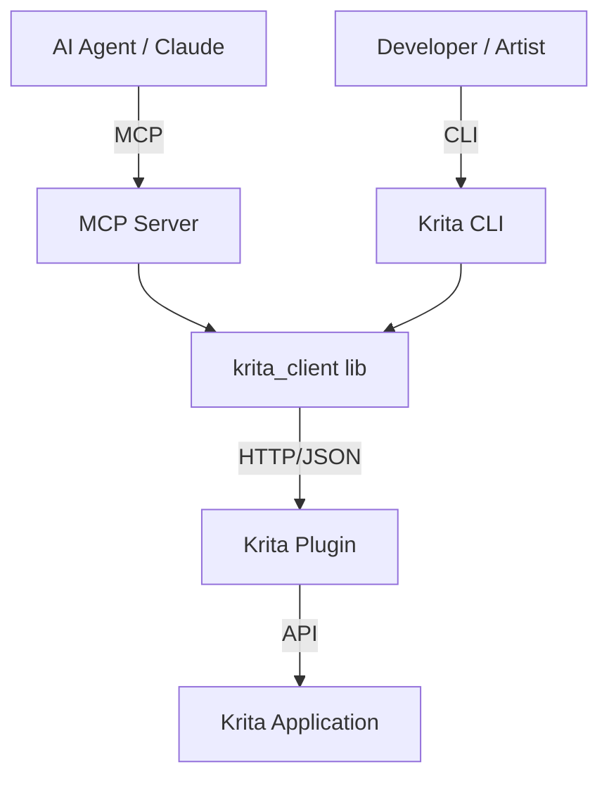

# Krita CLI & MCP Server

[](https://github.com/github/krita-cli/actions/workflows/ci.yml)
[](https://pypi.org/project/krita-cli/)
[](LICENSE)

A state-of-the-art **CLI interface** and **MCP server** for programmatic painting and automation in [Krita](https://krita.org/).

## 🌟 Overview

Krita CLI provides a bridge between AI agents (like Claude), developers, and the Krita desktop application. It enables real-time painting, canvas manipulation, and workflow automation via the Model Context Protocol (MCP) and a powerful command-line interface.

- **FastMCP Server**: Exposes 40+ specialized tools to AI agents.
- **Rich CLI**: Grouped commands for layers, selections, brushes, and session history.
- **Core Library**: Typed Python client (`krita_client`) for custom automation.
- **Krita Plugin**: High-performance Python plugin with numpy-accelerated rendering.

## 🚀 Quick Start

### 1. Prerequisites
- **Krita 5.2+** (with Python scripting enabled)
- **Python 3.12+**
- [**uv**](https://github.com/astral-sh/uv) (recommended) or `pip`

### 2. Installation

```bash
# Clone the repository
git clone https://github.com/github/krita-cli.git
cd krita-cli/krita-mcp

# Install dependencies and the package
uv sync
```

### 3. Setup Krita Plugin
Copy the contents of `krita-mcp/krita-plugin/` to your Krita resource folder:
- **Windows**: `%APPDATA%\krita\pykrita\`
- **Linux**: `~/.local/share/krita/pykrita/`
- **macOS**: `~/Library/Application Support/krita/pykrita/`

Enable **"Krita MCP Bridge"** in Krita via *Settings → Configure Krita → Python Plugin Manager*. Restart Krita.

## 🛠️ Usage

### Command Line Interface (CLI)
```bash
# Check connection
uv run krita health

# Paint a stroke
uv run krita stroke --points 100,100 150,200 200,100

# Manage layers
uv run krita layers list
uv run krita layers create --name "Background"

# Replay a session
uv run krita replay history.json
```

### MCP Server (for AI Agents)
Configure your MCP client (e.g., Claude Desktop) to run:
```bash
uv --directory /path/to/krita-cli/krita-mcp run python -m krita_mcp.server
```

## 🏗️ Architecture



## 🧪 Quality Standards
- **Test Coverage**: 95.00% (Unit, Integration, Property-based, E2E)
- **Type Safety**: 100% type-checked with `ty`
- **Linting**: Strict `ruff` configuration
- **Validation**: Pydantic v2 for all command schemas

## 📖 Documentation
- [Product Context](conductor/product.md)
- [Tech Stack](conductor/tech-stack.md)
- [Implementation Tracks](conductor/tracks.md)

## 📄 License
MIT License. See [LICENSE](krita-mcp/LICENSE) for details.
